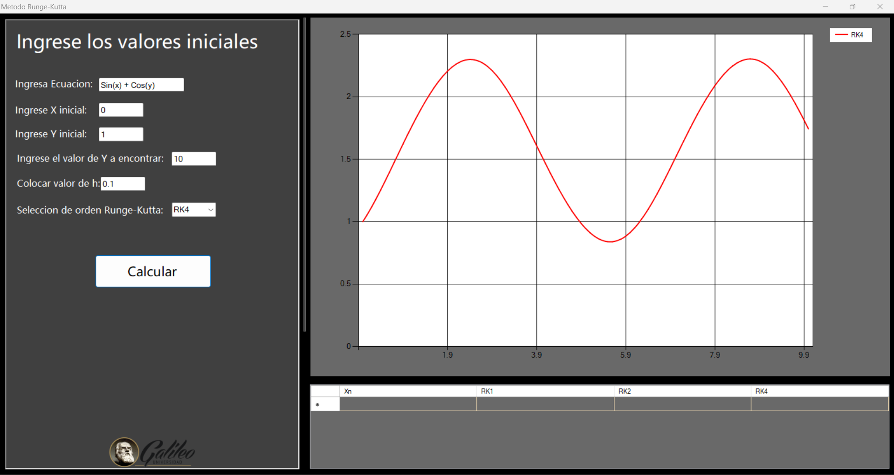

# C# Runge-Kutta ODE Solver

A desktop application built with C# and Windows Forms that numerically solves first-order ordinary differential equations (ODEs) using the Runge-Kutta methods (RK1, RK2, and RK4). The application provides a visual representation of the solutions and an analysis of the approximation error against known exact solutions.

## Overview

This project serves as a practical tool for students and engineers to visualize and understand numerical methods. Users can input any valid first-order ODE, set initial conditions, and compare the accuracy of different Runge-Kutta methods. The application leverages the **NCalc library** to dynamically parse and evaluate user-defined mathematical expressions, allowing for great flexibility.

## Key Features

- **Multiple Numerical Methods:** Implements the Euler method (RK1), the midpoint method (RK2), and the classic fourth-order Runge-Kutta (RK4).
- **Dynamic Equation Parsing:** Users can enter any ODE in the format `y' = f(x, y)` using standard mathematical notation (e.g., `Sin(x) + y`).
- **Graphical Visualization:** Plots the results of the numerical methods on a chart, allowing for easy comparison.
- **Error Analysis & Exact Solution Comparison:**
  - For a set of pre-defined equations with known analytical solutions, the application plots both the numerical approximation and the exact solution curve.
  - In these cases, it also calculates and displays the approximation error of each Runge-Kutta method in a data grid.

---

## Tech Stack

- **Language:** C#
- **Framework:** .NET Framework
- **UI:** Windows Forms
- **Charting:** `System.Windows.Forms.DataVisualization.Charting`
- **Expression Parsing:** [NCalc](https://github.com/ncalc/ncalc)

---

## Showcase & Demonstrations

The application's interface allows for clear visualization and comparison of the different numerical methods.

### 1. High-Precision Solution with RK4

The fourth-order Runge-Kutta method provides a highly accurate approximation, with its solution points closely matching the exact analytical curve. The error values in the table are minimal.


### 2. Low-Precision Solution with RK1 (Euler's Method)

In contrast, the first-order method (RK1) shows a noticeable deviation from the exact solution, which is reflected both visually in the plot and numerically in the error table.


### 3. Comparative Analysis of All Methods

The application can plot all three methods simultaneously, visually demonstrating the increasing accuracy from RK1 to RK4.


### 4. Solving Custom Arbitrary Equations

Thanks to the NCalc library, the solver is not limited to pre-defined problems. It can parse and solve complex, user-defined equations, such as those involving trigonometric functions. For these cases, a numerical solution is plotted, and the error analysis is correctly omitted as no analytical solution is provided.



---

## How to Compile and Run

1.  **Prerequisites:**
    - [Visual Studio](https://visualstudio.microsoft.com/) with the ".NET desktop development" workload installed.
    - .NET Framework (version 4.7.2 or compatible).

2.  **Clone the Repository:**
    ```bash
    git clone https://github.com/Jorge-Cuevas90003/CSharp-Runge-Kutta-Solver.git
    cd CSharp-Runge-Kutta-Solver
    ```

3.  **Open in Visual Studio:**
    - Double-click the `RungeKuttaVisualStudio.sln` file to open the solution.

4.  **Restore Dependencies:**
    - Visual Studio should automatically restore the NuGet packages listed in `packages.config` (like NCalc). If not, right-click on the solution in the Solution Explorer and select "Restore NuGet Packages".

5.  **Run the Application:**
    - Press the **"Start"** button (▶) or `F5` to compile and run the project.

---

## Author

- **Jorge Cuevas**
  - GitHub: [@Jorge-Cuevas90003](https://github.com/Jorge-Cuevas90003)
